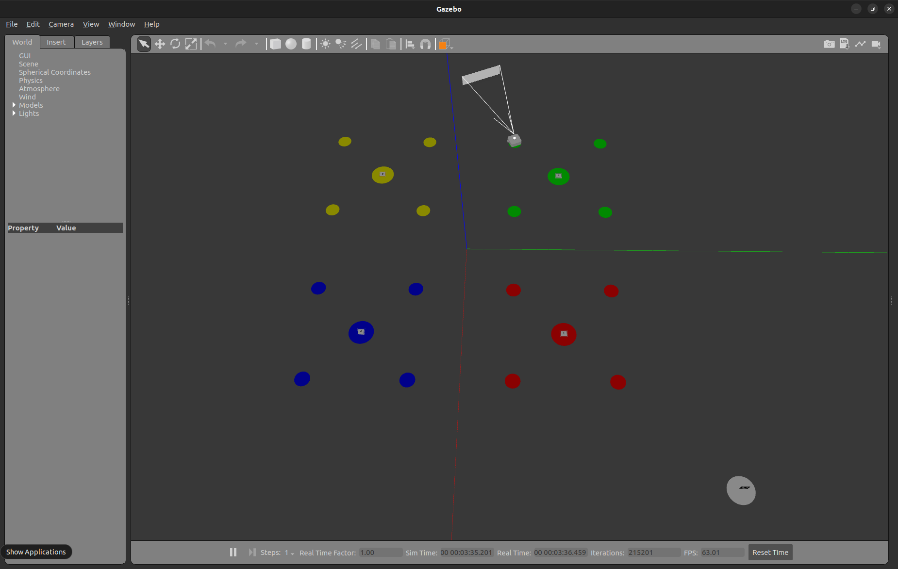
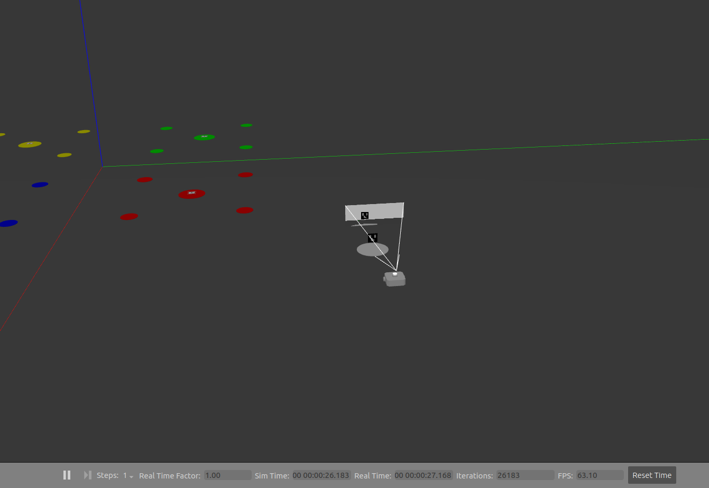
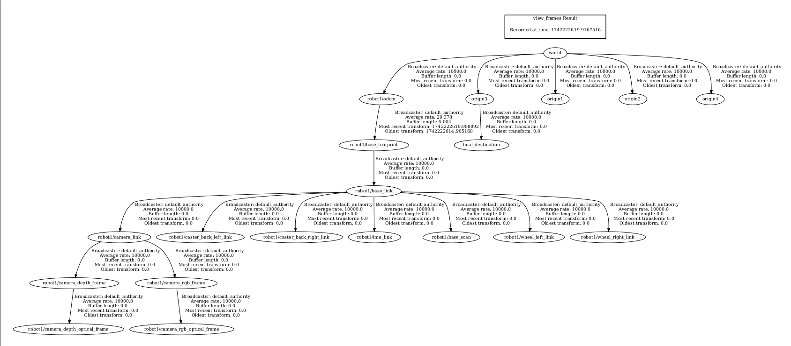

# Turtlebot3-control-using-Ros2-and-Fiducial-marker

A ROS-based system for odometry updates and fiducial marker-based navigation.

## Description

This project performs the following tasks:

odom_updater Package: Broadcasts the transform from the frame /robot1/base_footprint to the frame /robot1/odom.

### Augmented target_reacher Package:

The target_reacher node reads parameters from the final_params.yaml file.
    
Detects the fiducial marker and moves the robot to its location, making it rotate to scan and detect the marker.
    Uses OpenCV to detect the fiducial marker and determine the robot’s final destination.

### Final Destination Frame:

Broadcasts a frame final_destination representing the final destination of the robot in the origin1 frame.

Position: (final_destination.aruco_i.x, final_destination.aruco_i.y, 0)
Orientation: (0, 0, 0, 1)

### Transform Listener:

Retrieves the transform between final_destination and /robot1/odom.

Determines the final destination’s pose in the /robot1/odom frame.

### The TurtleBot moves to the final destination specified in the computed transform.

## Results

### Turtlebot reaching the target

### TurtleBot detects the fiducial marker and determines the final destination

### Final Tf tree

### Working Video

[Watch the demo](results/tb3_control.mp4)

## Dependencies

Python 3.10.12

opencv-contrib-python 4.6.0

## Changes need to be made in your bashrc file

export GAZEBO_MODEL_PATH=$GAZEBO_MODEL_PATH:<path_to_your_package>/Turtlebot3-control-using-Ros2-and-Fiducial-marker/Turtlebot3_control/tb3_gazebo/models

